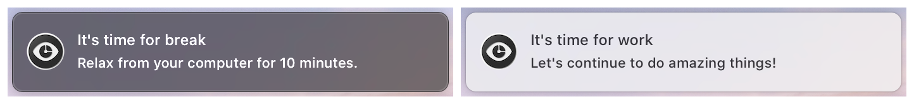

# SaveMyEyes

## MenuBar macOS application that helps to take breaks while using the computer.
[](https://www.codefactor.io/repository/github/masich/savemyeyes)
[](LICENSE)

You can choose a specific time interval and break time which perfects for you. For now, there are only a limited number of options, but the app will support direct time input in the future. 

Time interval - time in minutes to work on the computer before notification about break will be generated.

Break time - time in minutes to rest your eyes.

Features:
* Some general predefined work and break time interval sets.
* Time settings selected by the user into local storage.
* Automatically pauses and resumes timer by tracking user activity. 

The app is built using ```SwiftUI``` and requires macOS 10.15 to run.

## Screenshots
### MenuBar app


### Notifications


## License

This project is licensed under the MIT License - see the [LICENSE](LICENSE) file for details.