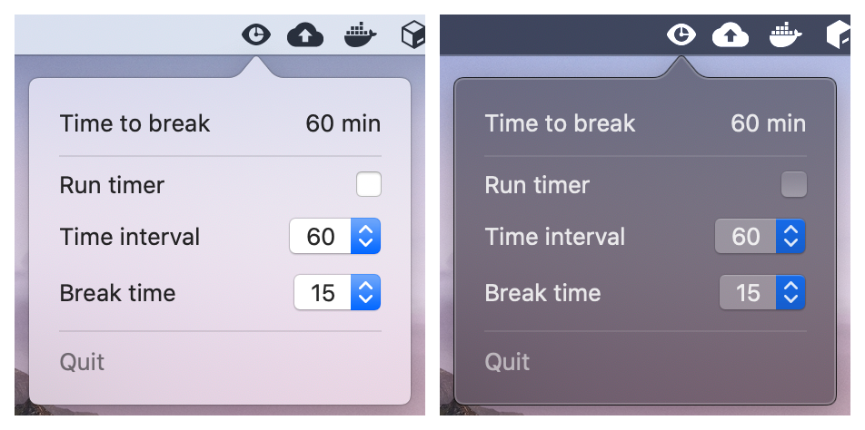
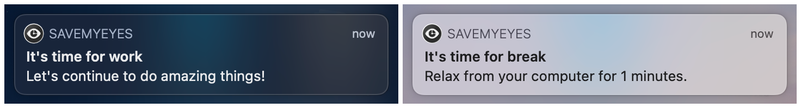

# SaveMyEyes

## MenuBar macOS application that helps to take breaks while using the computer.
[](https://www.codefactor.io/repository/github/masich/savemyeyes)
[](LICENSE)

You can choose specific work and break time intervals which perfect for you.

There are two types of time intervals the user has to select:
* *Work time*. It is a time interval in minutes to work on the computer before a notification about a break is generated.
* *Break time*. It is a time interval in minutes to rest your eyes.

Features:
* Minimalistic application design.
* Time settings selected by the user are saved in local storage.
* Automatically pauses and resumes timer depending on user activity.
* Sends reminder notifications based on the time presets selected by the user.

The app is built using ```SwiftUI``` and requires at least macOS 10.15.

## Installation guide
1. Download the latest [release](https://github.com/masich/SaveMyEyes/releases/) ```.dmg``` image and mount it.
2. [Drag & Drop](Images/Readme/Installation/Drag&Drop.png) SaveMyEyes app to the Application folder.
3. Open SaveMyEyes.
4. The [warning](Images/Readme/Installation/Warning.png) will appear according to the latest Catalina changes.
5. Go to the System Preferences and open its Security & Privacy tab.
6. Click your ["Open Anyway"](Images/Readme/Installation/Security.png) button.
7. Now, you can use this app without any restrictions and warnings.

This problem is caused by Apple's new software notarization system (as I correctly understood, it costs 100$ per year to publish "trusted" applications and fix this problem).
[Info](https://support.apple.com/en-us/HT202491) from the Apple site about this warning.

## Screenshots
### MenuBar app


### Notifications


## License
This project is licensed under the Apache-2.0 License - see the [LICENSE](LICENSE) file for details.
